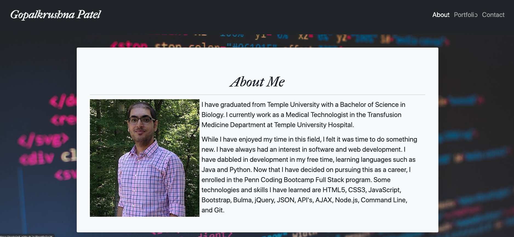
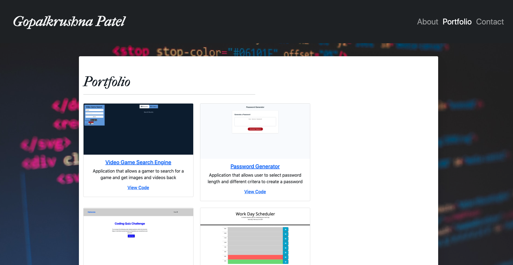
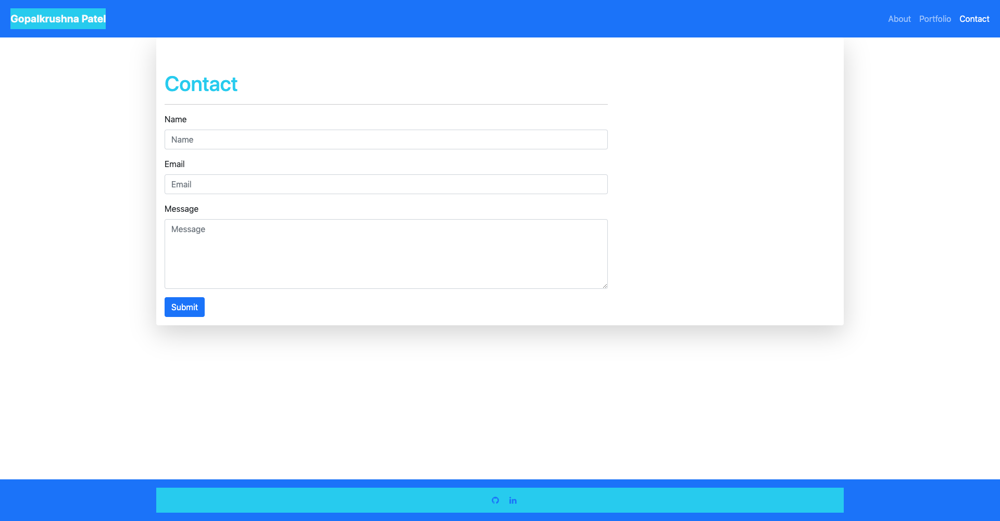

# 02_Responsive_Portfolio

## Description

This a web application for my personal portfolio, using a responsive design to ensure the application renders well on a variety of devices and window sizes. This application has a navbar at the top with links to three different pages, About, Portfolio, and Contact. The portfolio application has a responsive layout and images, using Bootstrap's grid system and framework.

The about page includes a brief bio. The portfolio page has images of projects with brief descriptions and links to the deployed page and github repository. The contact page has a form that can be filled out to send email to me and also has links to Github profile and Linkedin.

## Installation

Website URL: https://patelg1.github.io/Portfolio/

Repository URL: https://github.com/patelg1/02_Responsive_Portfolio

# Usage

