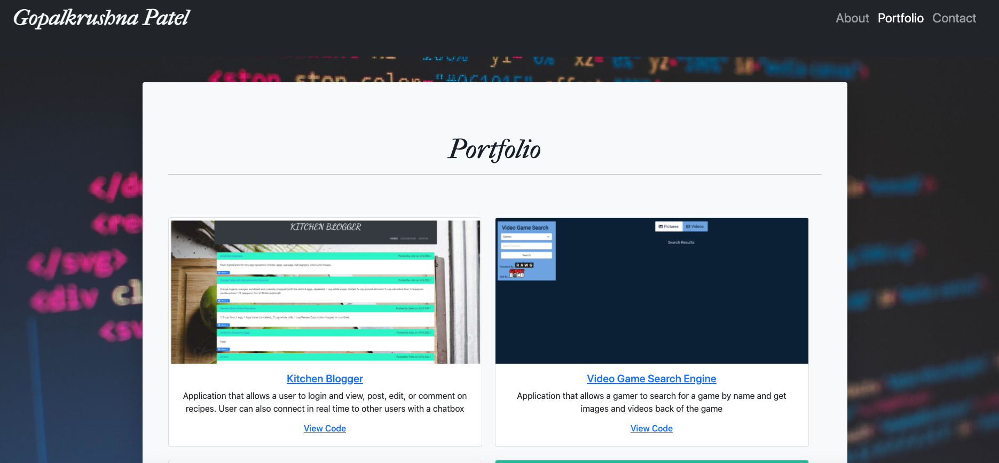

# 02_Responsive_Portfolio

## Description

This a web application for my personal portfolio, using a responsive design to ensure the application renders well on a variety of devices and window sizes. This application has a navbar at the top with links to three different pages, About, Portfolio, and Contact. The portfolio application has a responsive layout and images, using Bootstrap's grid system and framework.

## Installation

Website URL: https://patelg1.github.io/02_Responsive_Portfolio

Repository URL: https://github.com/patelg1/02_Responsive_Portfolio

# Usage

